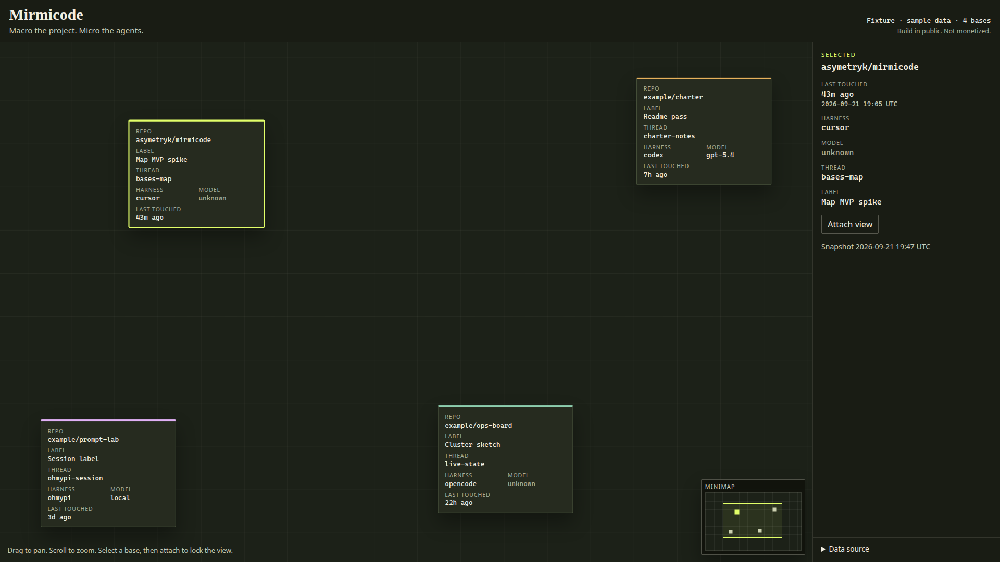
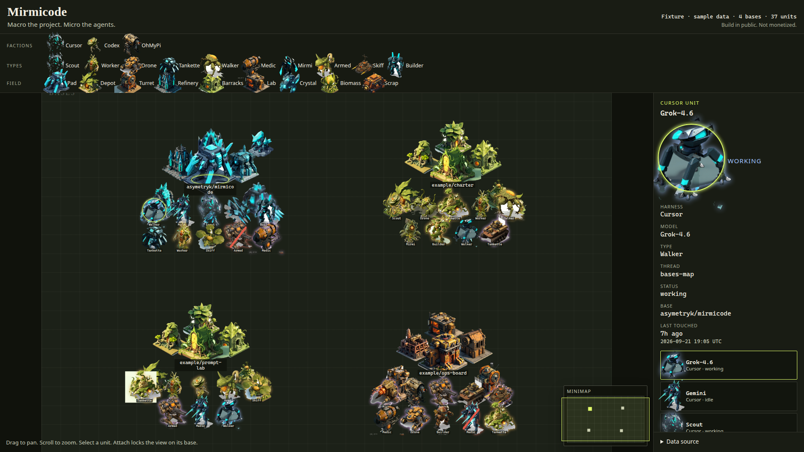

# Mirmicode

**Macro the project. Micro the agents.**

Bird’s-eye map of an agent campaign. A **base** is a repo outpost. A **faction** is a harness, and each faction has its own painted body — Cursor angular, Codex organic, OhMyPi mechanical. A **unit** is one agent on that outpost, a Mirmi. The **model picks the silhouette** from the v2 atlas: scout, worker, drone, tankette, walker, medic, mirmi, armed, skiff, or builder. The same model wears the same silhouette on whichever faction body it stands on. Idle and working add a ground marker. Blocked adds a red slash. The repo name and last touch stay in the HUD.

Build in public. Not monetized. No accounts, no payments, no analytics.





## Deploy

The real surface is **https://mirmicode.tail21f530.ts.net** on cluster **asym-k3s**, namespace `mirmicode`, pinned to node **asym-k1**. `http://127.0.0.1:5173` is interim local preview.

Labhand applies. This repo does not run `kubectl` from a cloud VM.

```bash
# On asym-k1, after the tailscale secret exists (below):
./deploy/k3s/mirmicode/build-image.sh
MIRMICODE_APPLY=1 ./deploy/k3s/mirmicode/apply.sh
```

`apply.sh` prints the plan and exits unless `MIRMICODE_APPLY=1`. It refuses a kube context whose name and cluster are both different from `asym-k3s` unless `MIRMICODE_ALLOW_CONTEXT=1`. The image tag defaults to `mirmicode.local/web:<git sha>` with `imagePullPolicy: Never`, so the build has to happen on asym-k1 and be imported into that node's containerd.

What the pod does:

- Caddy serves the Vite build on port 8080 inside the pod.
- The image bakes `VITE_WORKING_SET_URL=/working-set/api/v1/working-set`. The browser calls its own origin. CAHQ does not send CORS, and the browser never talks to it.
- A userspace Tailscale sidecar (`tag:homelab-sidecar`, hostname `mirmicode`) runs `tailscale serve --https=443` at that Caddy port. MagicDNS name: `mirmicode.tail21f530.ts.net`.
- Caddy reverse-proxies `/working-set/*` through the sidecar's SOCKS5 port (`127.0.0.1:1055`) to **https://cahq.tail21f530.ts.net**. Stripping `/working-set` leaves `/api/v1/working-set`. `working-set.tail21f530.ts.net` is stale and is not the upstream.
- A later in-cluster caller could use a ClusterIP Service on port 8080. v1 does not ship that Service. The browser surface is the Tailscale hostname.

### Secrets

Nothing under `deploy/` contains an auth key or a Working Set token. Create them on the cluster:

```bash
kubectl --context asym-k3s -n mirmicode create secret generic mirmicode-tailscale-auth \
  --from-file=authkey=./ts-authkey
```

The key is `authkey`. The file is a Tailscale auth key allowed to advertise `tag:homelab-sidecar`. State is a `local-path` PVC (`mirmicode-tailscale-state`), so later starts reuse the node identity and only read the key when tailscaled is logged out.

If CAHQ needs a bearer token, the browser still does not see it:

```bash
kubectl --context asym-k3s -n mirmicode create secret generic mirmicode-working-set \
  --from-file=token=./working-set-token
```

The key is `token` (raw token, no `Bearer ` prefix). The volume is optional. When the file is non-empty, Caddy adds `Authorization: Bearer <token>` on the upstream request only.

### What to copy from working-set-ui

`asymetryk/agentinfra` was not readable here (GitHub 404 for `deploy/k3s/working-set-ui`). The sidecar shape follows that packet, and the userspace entrypoint follows the public observatory manifest `deployment/k3s/ingress.yaml` (including its Tailscale image digest). Before the first apply, diff this directory against `deploy/k3s/working-set-ui` and keep that repo's values when they differ:

- Tailscale image digest
- Auth secret name and key (`authkey` here; observatory uses the same key name on `asymk3-tailscale-auth`)
- State: this PVC versus `TS_KUBE_SECRET` plus a ServiceAccount
- `tailscale serve` flags
- Apply flag spelling, if that repo uses something other than `MIRMICODE_APPLY`
- Resource requests

Do not copy a proxy target of `working-set.tail21f530.ts.net`.

## Local preview

Interim only. The deployed hostname above is the map people open.

```bash
npm install
npm run dev
```

Open http://127.0.0.1:5173. With no `VITE_WORKING_SET_URL`, the map loads the committed sample fixture: four bases, each with a multi-type squad from more than one faction, plus pad, depot, turret, refinery, barracks, lab, and a few resource props.

Tailscale Serve can front this dev server on a MagicDNS name. `server.allowedHosts` is `[".tail21f530.ts.net"]`, so Vite 6 accepts that suffix. The live Working Set origin is `https://cahq.tail21f530.ts.net`. Details are under **Point a tailnet machine at CAHQ** below.

```bash
npm test
npm run build
npm run preview
```

`preview` serves the static build at http://127.0.0.1:4173. A production `npm run build` without the Docker `ARG` does not bake the same-origin path; the image build does.

Drag to pan. Scroll to zoom. **Select** a unit to read its harness, model, thread, and status in the HUD. **Attach** locks the view on that unit’s base. The **minimap** jumps the view. Escape detaches. These are view controls. The map does not send orders to agents.

The legend under the title groups the atlas: faction bodies, the ten unit types, and the field (buildings and resource props). It does not list every file in the pack.

## Sprites

The map draws the staged v2 pack in `public/rts-art-v2/` (`STAGED.txt` is the file list). v1 art in `public/rts-art/` stays as the fallback when a mapping has no v2 file. v2 PNGs ship with a flat backdrop; the map keys that backdrop out at display time and does not replace the files.

A known model always picks one silhouette. A type word in the model string (`Scout`, `Mirmi-armed`) picks that sprite directly.

| Model | Silhouette | v2 file stem |
| --- | --- | --- |
| Astra, Scout | Scout | `scout-bot-01` |
| Luna, Worker | Worker | `worker-bot-02` |
| Terra, Drone | Drone | `drone-05` |
| Sol, Tankette | Tankette | `tankette-06` |
| Grok-4.6, Walker | Walker | `walker-07` |
| Gemini, Medic | Medic | `medic-bot-09` |
| MiniMax, Mirmi-small | Mirmi | `mirmi-small-03` |
| Kimi, Mirmi-armed | Armed | `mirmi-armed-04` |
| Skiff | Skiff | `skiff-08` |
| Builder | Builder | `builder-bot-10` |

The file is `units/{cursor|codex|ohmypi}-{stem}.png`. OpenCode and other harnesses use the neutral body when that file was staged.

Each base also shows a v2 outpost kit for the plurality faction: pad (the clickable base), depot, turret, refinery, barracks, and lab, plus crystal, biomass, and scrap props. A tie still breaks toward Cursor, then Codex, then OhMyPi. In the sample fixture that is Cursor on `asymetryk/mirmicode`, Codex on `example/charter` and `example/prompt-lab`, and OhMyPi on `example/ops-board`.

Working units get `fx/{faction}-work-marker-02.png`. Idle units get `fx/{faction}-idle-marker-01.png`. Selection is still a ring. Working still adds a faction-colored glow. Blocked still adds a red slash. Idle still dims the sprite.

### Wired vs staged-but-unused

Wired on the map: all ten unit roles for Cursor, Codex, and OhMyPi; neutral unit bodies as the fallback where the file exists; pad, depot, turret, refinery, barracks, and lab; crystal, biomass, and scrap; idle and work markers.

Staged but not drawn:

- `ui/neutral-alert-badge-04.png`
- `ui/neutral-button-plate-02.png`
- `ui/neutral-panel-corner-01.png`
- `ui/neutral-resource-pip-03.png`

Not in the staged subset, so they are not referenced: neutral pad, neutral mirmi-small, neutral mirmi-armed, neutral skiff. A missing v2 unit falls back to the v1 hero plus crest when that harness has one. A harness with neither (OpenCode on an unmapped model) keeps its faction color and a plain token.

v1 crests, used only on that fallback:

| Crest | File | Models |
| --- | --- | --- |
| A | `glyph-model-a.png` | Astra, Sol, MiniMax |
| B | `glyph-model-b.png` | Luna, Grok-4.6, Kimi |
| C | `glyph-model-c.png` | Terra, Gemini |

## Sample data

`src/data/sample-bases.json` is the map fallback: synthetic metadata so the map runs with nothing else reachable. `example/*` repos are not live telemetry. The status line says `Fixture · sample data`.

Each base carries a mixed squad, not one hero. `asymetryk/mirmicode` is a Cursor majority (Grok-4.6 walker, Gemini medic, plus scout, drone, builder, and tankette) with Codex Luna and Skiff and OhMyPi Kimi and Medic. The other bases are a Codex charter, an OhMyPi ops board, and a Codex prompt lab. Together the fixture fields every v2 silhouette.

`src/data/cahq-working-set.sample.json` is a separate flat `agents` document in the Working Set field shape (several units sharing a repo). It is also synthetic. It is not a capture from the tailnet host. Tests run it through the same normalizer the live fetch uses.

## Live Working Set vs fixture

CAHQ Working Set is the live source of truth: metadata only, for Cursor, Codex, OhMyPi, and OpenCode surfaces. This client does not vendor that service. OpenCode still renders as its own faction color if a payload names it.

The live upstream is `https://cahq.tail21f530.ts.net/api/v1/working-set`. CAHQ does not send CORS. The deployed map therefore calls the same-origin path `/working-set/api/v1/working-set`, and Caddy on the pod proxies that to CAHQ. `working-set.tail21f530.ts.net` is a stale hostname.

### What the client does

- **Fixture path.** Default when `VITE_WORKING_SET_URL` is empty and this browser has not saved a URL. No network. `loadFixture()` normalizes `src/data/sample-bases.json`.
- **Live path.** Paste a URL in **Data source**, or set `VITE_WORKING_SET_URL` (see `.env.example`). A path that starts with one `/` is resolved on the page origin; the deployed build uses `/working-set/api/v1/working-set`. A root URL without a query resolves to `/api/v1/working-set`; an explicit endpoint path or query is preserved. Fragments are removed. The browser sends an unauthenticated `GET` with `Accept: application/json`, `credentials: "omit"`, and `cache: "no-store"`. A JSON body with at least one base becomes the map. The status line reads `Live Working Set · N bases · M units` only after successful loading.
- **Fallback.** DNS/TLS/network/CORS failure, HTTP error, non-JSON, an empty or unsupported document, an oversized response, or a URL with embedded credentials loads the committed sample fixture. The status says `Fixture · sample data`, and an alert starts with `Fixture fallback.` and explains the failure category. Browser fetch cannot distinguish DNS/TLS/CORS failures. Raw error text and response bodies are never included in that alert. This is not cached live data; no live connection is claimed.

Startup URL precedence: a saved “use fixture” choice, then a URL saved in this browser, then `VITE_WORKING_SET_URL`, then the fixture.

### Open the deployed map

Join the tailnet and open **https://mirmicode.tail21f530.ts.net**. The baked URL is `/working-set/api/v1/working-set`. A root URL with no query still resolves to `/api/v1/working-set` when you paste an absolute origin; the deployed default is already the full same-origin path, so it is left as-is. If this browser saved a fixture choice or an old URL, paste `/working-set/api/v1/working-set` into **Data source** and press **Load**.

`VITE_` values are public and embedded at image build time. Do not put cookies, tokens, or userinfo in URLs or `VITE_` variables. The optional `mirmicode-working-set` secret is the auth hook: Caddy adds the bearer header on the pod, and the client still sends `credentials: "omit"`.

### Point a tailnet machine at CAHQ

Interim local preview, only when you are not on the deployed host. Join the tailnet so MagicDNS resolves `cahq.tail21f530.ts.net`.

1. Create an uncommitted `.env.local`:

   ```dotenv
   VITE_WORKING_SET_URL=http://127.0.0.1:5173/working-set/api/v1/working-set
   ```

2. Start the same-origin development proxy:

   ```bash
   WORKING_SET_PROXY_TARGET=https://cahq.tail21f530.ts.net npm run dev
   ```

3. Open **http://127.0.0.1:5173** (the hostname must match the configured URL). Vite forwards `/working-set/api/v1/working-set` to CAHQ, removing `/working-set`. If this browser saved a fixture choice or an old URL, paste `http://127.0.0.1:5173/working-set/api/v1/working-set` into **Data source** and press **Load** to override it.

Tailscale Serve can proxy this dev server at a MagicDNS name such as `howards-macbook-pro.tail21f530.ts.net`. `server.allowedHosts` is `[".tail21f530.ts.net"]`, so Vite 6 accepts that name and any other host on the same tailnet suffix.

With an origin that permits your browser via CORS, either direct setting works:

```dotenv
VITE_WORKING_SET_URL=https://cahq.tail21f530.ts.net
# Equivalent explicit endpoint:
# VITE_WORKING_SET_URL=https://cahq.tail21f530.ts.net/api/v1/working-set
```

CAHQ does not send a CORS allow-origin header, so the same-origin proxy above is the path that works in the browser. Restart Vite after changing environment variables. `VITE_` values are public and embedded at build time. The Vite development proxy is not included in the static image; the K3s image bakes `/working-set/api/v1/working-set` instead.

To check transport from a tailnet host without printing the body:

```bash
curl --silent --show-error --output /dev/null \
  --write-out 'HTTP %{http_code}; content type %{content_type}; TLS verify %{ssl_verify_result}\n' \
  https://cahq.tail21f530.ts.net/api/v1/working-set
```

### Contract

`normalizeWorkingSetPayload` in `src/adapters/normalize.ts` accepts:

- a top-level array, or
- an object with a `bases`, `items`, `records`, `agents`, or `units` array (the first of those keys that is an array wins)

Three record shapes collapse into the same map:

1. **Grouped base.** One object per repo, with a `units` array (or `agents`, same meaning). This is the shape to prefer once Working Set can emit multi-unit rows.
2. **Flat unit row.** One object per agent. Rows that share a repo, ignoring case, become one base with many units. A legacy single harness/model row is one unit on that repo.
3. **Nested live item.** `items[]` contains `item_id`, `observed`, `annotation`, and `associations`. Repository metadata comes from `observed`; user overrides come from `annotation`. Missing nested repository metadata is retained under one **Unassigned** base. `source_label` is session-oriented and is never a base key.

Flat rows do not invent a second unit from a parent harness when `units` or `agents` is present. The parent harness and model are ignored in that case.

| Map field | Accepted keys | Notes |
| --- | --- | --- |
| Repo / base | Nested: `observed.repo_name`, then `observed.repo`; flat: `repo_name`, `repo`, `repository`, `project`, `full_name`, or `base` | `base` may be a string or an object with `repo`, `repository`, `full_name`, or `name`. Nested items without a repo share Unassigned; flat records without a repo are dropped. Same repo merges case-insensitively. |
| Base id | `id` on a grouped base | Optional. Derived from the repo when omitted. Duplicate base ids get a numeric suffix. On a flat row, `id` belongs to the unit. |
| Base label | `label` on a grouped base | Human name for the repo. Flat-row `label` stays on the unit. |
| Units | `units` or `agents` | Array of unit objects. Omit it and the record itself is one unit. |
| Faction / harness | `observed.surface`, `observed.harness`, then flat `harness` or `surface` | Lowercased. `oh-my-pi` and `open-code` fold onto `ohmypi` and `opencode`. Missing becomes `unknown`. |
| Unit type / model | `observed.model`, then flat `model` | Blank or missing becomes `unknown`. |
| Thread | `thread_name` or `threadName` | Empty renders as an em dash. |
| Status | `annotation.status`, `observed.lifecycle`, `observed.presence`, then flat `status` | First nonblank string wins. `working`, `active`, and `busy` glow; `blocked`, `queued`, `stuck`, and `error` take the blocked slash. Other values are idle. |
| Unit label | `annotation.label`, flat `label`, then `thread_name` / `threadName` | First nonblank string wins. |
| Last prompt | Flat `last_prompt`, `lastPrompt`, `last_user_message`, `lastUserMessage`, `user_prompt`, `userPrompt`, `prompt`, `input`, then `annotation.note` | First nonblank string wins; non-string values are ignored. Never derived from `annotation.label`. |
| Last touched | `annotation.updated_at`, `observed.updated_at`, then flat `updated_at`, `updatedAt`, `last_touched`, or `lastTouched` | The base shows the latest valid unit time. |
| Placement | `x`, `y` on the base | Optional numbers in `0..1`. Map presentation only. Ignored when out of range. |

Unknown fields and transcript bodies are ignored. Display metadata is capped at 180 characters, except prompt text, which is retained for full native `title` tooltips. The HUD and roster show `Last prompt:` with prompt text shortened to 140 characters; without a prompt they show `Thread:` using the unit label/thread name. Map-unit titles use the same honest prefix with full prompt text. The live API currently has no dedicated last-user-prompt field; an annotation note is the supported nested fallback. Both sample fixtures include fictional prompt text and label-only units. A grouped fixture record looks like this:

```json
{
  "bases": [
    {
      "id": "mirmicode",
      "repo": "asymetryk/mirmicode",
      "label": "Map MVP",
      "x": 0.3,
      "y": 0.28,
      "units": [
        {
          "id": "mirmicode-grok",
          "harness": "cursor",
          "model": "Grok-4.6",
          "thread_name": "bases-map",
          "status": "working",
          "updated_at": "2026-09-21T19:05:00Z"
        }
      ]
    }
  ]
}
```

When the live payload uses different names, extend the alias lists in `normalize.ts`. The UI only renders `CampaignBase` and `Unit` (`src/types.ts`).

## Lore

You are the commander. Agents on a base are Mirmis — a myrmidon word for the units under that command. Factions are the harnesses those units belong to. The name is flavor. The product is the map.

## Out of scope

Spectating a session, dragging work onto another base, chat or retask orders, a game engine, payments, and any analytics SDK.
