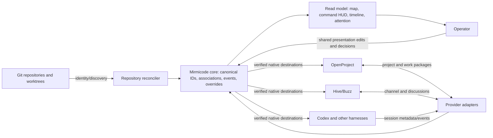

# Mirmicode migration plan

Mirmicode's product job is to answer three questions from one place: **What projects exist? What are their agents doing now? Where do I go to act?** The map is the spatial entry point; a compact command HUD, activity timeline, and attention queue make the same facts usable when the map is crowded. The current standalone UAT proves a narrow live slice, not the completed product.

## Data contract

The canonical repository key is the normalized Git origin, not a directory name. Linked worktrees and independent clones of one origin map to one repository. Each distinct repository has one dedicated OpenProject project and one dedicated Hive channel; every work package has a dedicated discussion thread. A new repository split gets a new identity and its own associations. The split workflow records lineage, moves the relevant work packages/discussion context intentionally, and marks the old association as transferred or retained. It never silently reassigns history.

Mirmicode owns the association record, presentation overrides, and a small event/audit log. Git owns code; OpenProject owns work packages and human commitments; Hive owns discussion; harnesses own their threads and execution. Source adapters report observations with source IDs, timestamps, confidence, and native identifiers. User edits are a separate layer, so a collector refresh cannot erase a chosen unit name, building appearance, position, or verified destination. A user can reset an override to the source value. The public view exposes only metadata needed for observation; it never needs prompt bodies or credentials.

The first UAT uses SQLite and one writer. This is adequate for the current single-player deployment. Before multiple editors, add authenticated users, per-project roles, optimistic concurrency/version checks, and an audit trail; then test whether the single-writer store still meets latency and availability needs. The provider boundary should be a stable adapter contract, so Jira/Notion can replace OpenProject and Slack/Discord can replace Hive without changing map semantics.

## Three operating loops

**Initial deployment.** Install the Mirmicode service on the user's chosen host and connect Git access, one work tracker, one discussion provider, and the harnesses they use. Run discovery in preview mode. Show canonical origins, duplicate clones/worktrees, missing or conflicting project/channel associations, and permissions needed. Let the operator approve a reconciliation plan, then provision only the missing dedicated contexts, save verified native URLs, register collectors, and start the feed. A fresh install must work without CAHQ, Baserow, or Howard's private registry.

**Adding something new.** Detect a new Git origin or let the user add one. Reuse an existing association only when origin identity matches; otherwise create its project and channel, seed a repository dossier, and attach harness sessions. If an idea graduates out of a parent repository, use a split wizard with a reviewed move plan for code, issues, discussion links, docs, and agent context. Verify the new repository is independently operable before declaring the cut complete.

**Steady-state homeostasis.** Collectors emit normalized session metadata and heartbeats; provider adapters reconcile projects/channels/work packages and detect drift. The core deduplicates by native identity, retains recent completions, marks missing signals unknown, and surfaces actionable failures in an attention queue. The UI shows where agents are working, where they recently finished, and which verified signals require a decision. A direct link opens the exact task, work package, channel thread, or harness surface; unsupported destinations are labeled unavailable rather than guessed. Backups, restore drills, collector health, and association checks are part of the service's normal operation.

## Migration gates

| Gate | Product behavior and acceptance | Current state |
| --- | --- | --- |
| 1. Standalone spine ([WP #788](https://openproject.tail21f530.ts.net/work_packages/788)) | Core service runs without CAHQ/Baserow in its request path; authenticated ingest, durable store, source freshness, parent/subagent identities, read-only HUD, restore smoke. | Isolated K3s UAT has a live Codex source and a reviewed 31-origin static seed. First-install automation, restore smoke, and production cutover remain. |
| 2. Spatial clarity ([WP #782](https://openproject.tail21f530.ts.net/work_packages/782)) | Map fills the stage at desktop and laptop sizes; selecting units never hides them; grouping/focus handles many repos and concurrent threads. | Desktop UAT has a full-stage map, visible selection, a parent/subagent inspector, and live-work/all-camps scope; final scope-toggle browser acceptance remains. |
| 3. Shared control ([WP #783](https://openproject.tail21f530.ts.net/work_packages/783)) | Authorized edits to unit/building presentation persist across users and refreshes, with version conflict and reset behavior; repository, work, Hive, and latest thread links resolve to verified destinations. | Shared presentation edits and reset passed in isolated UAT. GitHub/OpenProject links are present; Hive browser routes and exact thread URLs are not verified. |
| 4. Multi-harness observation ([WP #784](https://openproject.tail21f530.ts.net/work_packages/784)) | Concurrent parent/subagent threads, recent completions, attention signals, freshness, and native observation links work across supported harnesses. | One Codex metadata collector and its parent/subagent group are live in UAT; other harnesses, verified native task links, and blocked signals remain. |
| 5. Install and reconcile | Fresh installation discovers an existing environment, previews and applies missing one-to-one contexts, and keeps them reconciled. Splits have a controlled transfer flow. | Architecture defined here; implementation pending. |
| 6. Multiplayer foundation ([WP #785](https://openproject.tail21f530.ts.net/work_packages/785)) | Multiple authenticated people can see the same state, claim a decision, discuss it, and avoid conflicting actions with audit and concurrency controls. | Roadmap. |
| 7. Provider swap ([WP #786](https://openproject.tail21f530.ts.net/work_packages/786)) | Work, discussion, and harness adapters can be replaced using contract tests while the core and UI stay stable. | Roadmap. |

The optional animated 3D visual track is scoped in [the prototype note](visual-3d-prototype.md). It follows the single-player observation and action loop; it does not gate that release.

Promotion is evidence-based: local checks, exact K3s image/UAT, review, merge, and production browser acceptance are separate gates. Production currently serves the legacy feed and remains the rollback path. The `/Users/howard/Developer` audit is a separate inventory of broken Git markers, duplicate clones, and dirty trees; it must not become an implicit deletion or global `git worktree prune` step.
