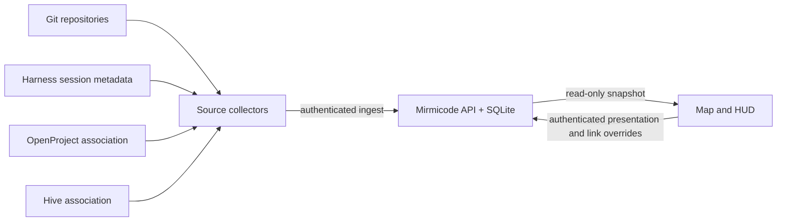

# Standalone core migration

WP [#788 Build standalone Mirmicode core and live feed](https://openproject.tail21f530.ts.net/projects/repo-mirmicode/work_packages/details/788/overview) is the first migration slice. The existing Caddy/Working Set deployment remains the rollback path until an isolated UAT and reviewed release pass.



The server owns durable repository and session records. A collector identifies a repository by canonical Git origin and sends metadata through an idempotent ingest endpoint. A partial repository update retains existing OpenProject, Hive, and presentation fields supplied by another source. The first collector reads Codex JSONL session metadata and explicit `task_started`/`task_complete` events. It does not transmit prompt bodies or claim a blocked state without a signal. It marks a long-unobserved active task `unknown`. The API marks all sessions from a source `unknown` when that source stops reporting, and shows a stale banner. Parent IDs preserve subagent hierarchy. A session may have a native URL only when an adapter supplies a verified URL; the Codex collector currently leaves it blank.

The local `REPO_REGISTRY.json` is an **optional migration importer** for known OpenProject associations, not a runtime dependency. A new installer can start with Git remotes alone. Provider connectors and reconciliation of one project and one Hive channel per repository remain later migration stages.

Build `deploy/k3s/mirmicode/standalone.Dockerfile` on `asym-k1`, import the image into K3s, and deploy it into an isolated UAT workload with its own persistent volume and dedicated ingestion token file. The Vite build uses `VITE_FEED_SOURCE=server`; the browser calls same-origin `/api/v1/snapshot` every 15 seconds. The selected view remains mounted between refreshes. The old production Deployment and Dockerfile are unchanged. Rollback means deleting the UAT workload; production continues on the previous image.

For a macOS Codex source, install the operator-side poller with `python3 server/install_codex_collector.py --endpoint https://mirmicode-uat.tail21f530.ts.net --token-file <private-token-file> --registry <optional-registry>`. It copies the collector to `~/.local/share/mirmicode/` and starts a 60-second `com.mirmicode.collect-codex` LaunchAgent. The token file must be mode `0600`; the token value is never part of the plist. The collector scans only sessions modified in the last 24 hours by default. Other harnesses need their own adapters and source identities.

An ingestion token belongs in the approved secret manager and a mounted K3s Secret, never in the Vite build or repository. The public snapshot is read-only; the token guards `POST /api/v1/ingest`. Shared presentation and link overrides live separately from source observations. The single-operator edit API accepts `PUT /api/v1/metadata` with an `expected_revision`; edits are audited against an actor ID derived from the editor credential, and stale writes return HTTP 409 with the current revision. Manual HTTPS link overrides are labeled `manual` in the snapshot; they are not provider-verified destinations. `latest_thread` remains source-only and is populated only from a session's verified `native_url`.

The editor token is separate from the ingestion token. Set `MIRMICODE_EDITOR_TOKEN_FILE=/run/secrets/editor-token` (the default) and mount the private editor token there using a dedicated K3s Secret. If that file is missing, editing returns HTTP 503 and public snapshot/ingest behavior remains available. Never place the editor value in the image, repository, Vite environment, or browser storage. The browser submits the operator-entered token once to same-origin `POST /api/v1/session`; the server verifies it, returns an eight-hour `HttpOnly; Secure; SameSite=Strict` cookie, and never returns the token. `GET /api/v1/session` reports only whether that cookie is valid. Session exchange and cookie-authenticated metadata writes require an HTTPS `Origin` matching `Host`; `DELETE /api/v1/session` clears the cookie. One credential identifies one shared operator actor in the audit log; per-person identity and project roles remain a multiplayer gate.

The snapshot root carries `metadata_revision`; use the camp's source `repo_key` for writes. A representative request is:

```json
{
  "expected_revision": 4,
  "repo_key": "github.com/asymetryk/mirmicode",
  "appearance": { "color": "#315A9B", "building_set": ["pad", "depot", "lab"] },
  "links": { "openproject_url": "https://openproject.example/projects/repo-mirmicode" },
  "unit_id": "task-123",
  "unit_appearance": { "color": "#EAA13A", "unit_role": "builder" }
}
```

`PUT /api/v1/metadata` returns `{ "revision": 5 }`. A stale revision returns HTTP 409 and `{ "error": "revision_conflict", "revision": <current> }`; refetch the snapshot before applying the user's change again. Set a link field to `null` to explicitly clear it. Use `reset: { "links": ["openproject_url"] }` or `reset: { "appearance": ["color"] }` to remove an override and restore the source/default value; unit appearance resets use `unit_id` and `reset: { "unit_appearance": ["unit_role"] }`. Building sets accept `pad`, `depot`, `turret`, `refinery`, `barracks`, and `lab`. Unit roles accept `scout`, `worker`, `drone`, `tankette`, `walker`, `medic`, `mirmi-small`, `mirmi-armed`, `skiff`, and `builder`. Each successful transaction writes an audit row with the credential-derived actor ID and before/after values. Snapshot `link_provenance` distinguishes `manual`, `observation`, and `none`. The latest-thread destination is the newest session's source-provided `native_url`; when that newest session has no URL, `latest_thread` is null even if an older session has one.

K3s tests prove parsing, persistence, rollback on invalid payloads, partial multi-source updates, and compilation. The isolated UAT is at `https://mirmicode-uat.tail21f530.ts.net/`; verify its current image before using this record as release evidence. Candidate `mirmicode.local/standalone-uat:20260923-g` passed 145 frontend and 15 server tests plus the TypeScript/Vite production build on `asym-k1`. A K3s-hosted Chromium session at 1920×1080 showed the map filling its viewport, a selected working unit remaining visible beside the inspector, and a live HUD with two working and seven recently completed units. Through an ephemeral HTTPS test proxy, the shared editor changed a unit form and the camp building set, preserved both after reload, and reset both to source defaults; the edit session was then ended. A later frontend-only correction gives completed units an explicit visual state, moves the edit control above the roster, maps versioned GPT model names to their v2 silhouettes, and replaces opaque status FX artwork with CSS ground signals. That correction passed 156 frontend tests and the production build on K3s and still needs browser proof on a new exact-head image. Earlier UAT checks showed unauthenticated ingest returning HTTP 401, PVC persistence through restart, and an online SQLite backup restoring with matching row counts and integrity. These checks do not prove native Codex deep links, a signed Hive agent reply, a general first-install journey, or production cutover. Record those separately on WP #788 before promotion.
