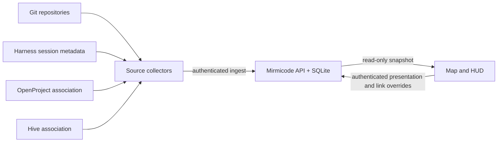
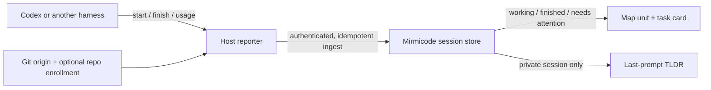

# Standalone core migration

WP [#788 Build standalone Mirmicode core and live feed](https://openproject.tail21f530.ts.net/projects/repo-mirmicode/work_packages/details/788/overview) is the first migration slice. The existing Caddy/Working Set deployment remains the rollback path until an isolated UAT and reviewed release pass.



The server owns durable repository and session records. A collector identifies a repository by canonical Git origin and sends metadata through an idempotent ingest endpoint. A partial repository update retains existing OpenProject, Hive, and presentation fields supplied by another source. The first collector reads Codex JSONL session metadata and explicit `task_started`/`task_complete` events. It does not transmit prompt bodies or claim a blocked state without a signal. It marks a long-unobserved active task `unknown`. The API marks all sessions from a source `unknown` when that source stops reporting, and shows a stale banner. Parent IDs preserve subagent hierarchy. The Codex collector supplies `codex://threads/<id>` only when the session ID is a canonical UUID and agrees with its rollout filename; otherwise the native URL stays blank.

The local `REPO_REGISTRY.json` is an **optional migration importer** for known OpenProject associations, not a runtime dependency. A new installer can start with Git remotes alone. Provider connectors and reconciliation of one project and one Hive channel per repository remain later migration stages.

## Agent reporting contract

Think of repository enrollment and harness reporting as separate installations. A repository supplies its canonical Git identity and optional OpenProject/Hive associations. A reporter runs once on each host or harness that owns threads, discovers the active repository for each thread, and publishes lifecycle observations to the authenticated ingest endpoint. Linked worktrees of one Git origin resolve to the same camp. No agent needs to post directly to OpenProject or Hive just to keep the map current.



The source contract keeps lifecycle separate from outcome. `status` says `working`, `completed`, `needs-attention`, or `unknown`; a completed turn only proves that execution stopped. `outcome` is nullable and requires an explicit assessment with evidence before the UI describes the user's objective as achieved, partial, needing help, or failed. `started_at`, `finished_at`, and `duration_ms` describe the latest observed run. `token_usage` is nullable and source-provided; absent counts are unknown, not zero or a bill. The Codex adapter currently supplies a short, filtered keyword sketch of the latest user request under `prompt_tldr`, not a semantic summary. Raw prompts and transcripts are not sent. The anonymous snapshot hides the sketch; an authenticated private session can request it.

The current Codex adapter reconciles JSONL sessions every 60 seconds and the browser refreshes the snapshot every 15 seconds. This gives a useful observation view but is **not** a guaranteed start/finish event stream: a short run can finish between polls. Codex's `notify` setting is host-level, but [trusted project-local lifecycle hooks](https://learn.chatgpt.com/docs/hooks) can signal prompt submission, turn completion, and subagent start/stop. This repository's `.codex/hooks.json` wakes the already installed host reporter on those events without carrying credentials or prompt content; the periodic scan remains the repair loop. Codex requires an explicit trust review of the exact hook definition, so an untrusted or disabled hook falls back to polling. Other harnesses can implement the same ingest contract without changing the map. An evaluator of task quality should publish a separate evidence-backed assessment rather than treat `task_complete` or a model claim as proof.

For this UAT, `server/import_registry.py --dry-run --registry <private-registry>` previews one camp per verified Git origin and reports omitted unresolved identities. `--apply` posts that reviewed seed through authenticated ingest. The seed is a static catalog: it does not claim activity or make the live collector stale. GitHub origins have repository links; other origins keep their identity without an invented browser URL. Local filesystem origins become opaque keys with a safe display label, so private paths never enter the public snapshot. A canonical Buzz channel UUID from the registry becomes a `buzz://channel/<uuid>` destination; the installed Buzz Desktop 0.5.24 release handles that route. This is a channel route, distinct from a WP-specific message thread.

Build `deploy/k3s/mirmicode/standalone.Dockerfile` on `asym-k1`, import the image into K3s, and deploy it into an isolated UAT workload with its own persistent volume and dedicated ingestion token file. The Vite build uses `VITE_FEED_SOURCE=server`; the browser calls same-origin `/api/v1/snapshot` every 15 seconds. The selected view remains mounted between refreshes. The old production Deployment and Dockerfile are unchanged. Rollback means deleting the UAT workload; production continues on the previous image.

For a macOS Codex source, install the operator-side poller with `python3 server/install_codex_collector.py --endpoint https://mirmicode-uat.tail21f530.ts.net --token-file <private-token-file> --registry <optional-registry>`. It copies the collector to `~/.local/share/mirmicode/` and starts a 60-second `com.mirmicode.collect-codex` LaunchAgent. The token file must be mode `0600`; the token value is never part of the plist. The collector scans only sessions modified in the last 24 hours by default. Other harnesses need their own adapters and source identities.

To enroll an additional Git worktree in the prompt/turn hook, preview `python3 server/install_codex_repo_hook.py --repo <target-repo>` and then use `--apply`. The installer merges four Mirmicode lifecycle groups into an existing `.codex/hooks.json` without replacing unrelated hooks, copies only the no-secret wake script, and refuses conflicting local edits. It does not install the host reporter or trust a hook on the operator's behalf. Review the new project-local hook through Codex `/hooks`; if it is not trusted, the 60-second host scan still updates the map. Worktrees of the same canonical Git repository share a camp; installing the hook in each independently used worktree is optional acceleration, not a separate project/channel association.

An ingestion token belongs in the approved secret manager and a mounted K3s Secret, never in the Vite build or repository. The public snapshot is read-only; the token guards `POST /api/v1/ingest`. Shared presentation and link overrides live separately from source observations. The single-operator edit API accepts `PUT /api/v1/metadata` with an `expected_revision`; edits are audited against an actor ID derived from the editor credential, and stale writes return HTTP 409 with the current revision. Manual HTTPS link overrides are labeled `manual` in the snapshot; they are not provider-verified destinations. `latest_thread` remains source-only and is populated only from a session's verified `native_url`.

The editor token is separate from the ingestion token. Set `MIRMICODE_EDITOR_TOKEN_FILE=/run/secrets/editor-token` (the default) and mount the private editor token there using a dedicated K3s Secret. If that file is missing, editing returns HTTP 503 and public snapshot/ingest behavior remains available. Never place the editor value in the image, repository, Vite environment, or browser storage. The browser submits the operator-entered token once to same-origin `POST /api/v1/session`; the server verifies it, returns an eight-hour `HttpOnly; Secure; SameSite=Strict` cookie, and never returns the token. `GET /api/v1/session` reports only whether that cookie is valid. Session exchange and cookie-authenticated metadata writes require an HTTPS `Origin` matching `Host`; `DELETE /api/v1/session` clears the cookie. One credential identifies one shared operator actor in the audit log; per-person identity and project roles remain a multiplayer gate.

The snapshot root carries `metadata_revision`; use the camp's source `repo_key` for writes. A representative request is:

```json
{
  "expected_revision": 4,
  "repo_key": "github.com/asymetryk/mirmicode",
  "appearance": { "color": "#315A9B", "building_set": ["pad", "depot", "lab"] },
  "links": { "openproject_url": "https://openproject.example/projects/repo-mirmicode" },
  "unit_id": "task-123",
  "unit_appearance": { "color": "#EAA13A", "unit_role": "builder" }
}
```

`PUT /api/v1/metadata` returns `{ "revision": 5 }`. A stale revision returns HTTP 409 and `{ "error": "revision_conflict", "revision": <current> }`; refetch the snapshot before applying the user's change again. Set a link field to `null` to explicitly clear it. Use `reset: { "links": ["openproject_url"] }` or `reset: { "appearance": ["color"] }` to remove an override and restore the source/default value; unit appearance resets use `unit_id` and `reset: { "unit_appearance": ["unit_role"] }`. Building sets accept `pad`, `depot`, `turret`, `refinery`, `barracks`, and `lab`. Unit roles accept `scout`, `worker`, `drone`, `tankette`, `walker`, `medic`, `mirmi-small`, `mirmi-armed`, `skiff`, and `builder`. Each successful transaction writes an audit row with the credential-derived actor ID and before/after values. Snapshot `link_provenance` distinguishes `manual`, `observation`, and `none`. The latest-thread destination is the newest session's source-provided `native_url`; when that newest session has no URL, `latest_thread` is null even if an older session has one.

K3s tests prove parsing, persistence, rollback on invalid payloads, partial multi-source updates, and compilation. The isolated UAT is at `https://mirmicode-uat.tail21f530.ts.net/`; verify its current image before using this record as release evidence. Candidate `mirmicode.local/standalone-uat:20260923-g` passed 145 frontend and 15 server tests plus the TypeScript/Vite production build on `asym-k1`. A K3s-hosted Chromium session at 1920×1080 showed the map filling its viewport, a selected working unit remaining visible beside the inspector, and a live HUD with two working and seven recently completed units. Through an ephemeral HTTPS test proxy, the shared editor changed a unit form and the camp building set, preserved both after reload, and reset both to source defaults; the edit session was then ended. A later frontend-only correction gives completed units an explicit visual state, moves the edit control above the roster, maps versioned GPT model names to their v2 silhouettes, and replaces opaque status FX artwork with CSS ground signals. That correction passed 156 frontend tests and the production build on K3s and still needs browser proof on a new exact-head image. Earlier UAT checks showed unauthenticated ingest returning HTTP 401, PVC persistence through restart, and an online SQLite backup restoring with matching row counts and integrity. These checks do not prove native Codex deep links, a signed Hive agent reply, a general first-install journey, or production cutover. Record those separately on WP #788 before promotion.

On 2026-09-24, the task-card candidate `mirmicode.local/standalone-uat:20260924-taskcard-r3` passed 166 frontend tests, 32 server tests, the TypeScript/Vite build, and JSON/Python syntax checks for the project hook on `asym-k1`. The isolated UAT deployment rolled out with that image; production stayed on `mirmicode.local/web:0f11f0d`. K3s-hosted Chrome at 1920×1080 showed a working unit selected beside the map with status, elapsed time, and session token totals. An anonymous view showed the sign-in placeholder for request keywords; an authenticated session showed a filtered keyword sketch, never the raw prompt. This proves the private display path, not a semantic summary or objective-success evaluation. The host's existing 60-second collector has published the new fields to UAT, but the repo-local lifecycle hook has not yet been trusted or observed firing. A completed turn still has an unassessed outcome until a separate evidence source supplies one. WP #788's dedicated Hive discussion and reciprocal links were not verified as of this run, so the charter's pre-commit gate remains open.

The final UAT image for this slice is `mirmicode.local/standalone-uat:20260924-taskcard-r4`; it retains the browser-proven frontend assets from r3 and adds the reusable repo-hook installer plus evidence-required outcome validation. The r4 K3s build passed 166 frontend tests, 32 container server tests, and six separate installer tests on `asym-k1` (the container skips those six because the runtime image intentionally has no Git CLI). The r4 rollout completed and its public HTTPS route returned HTTP 200. The project-local hook still requires Codex trust review before event-triggered wakeups can be claimed live.

WP #788 now has a [dedicated private Buzz discussion](buzz://message?channel=b9faf317-85e2-4a89-ab4e-592791f70f3c&id=3027e295a728165f58f11dfdff611fca6c778d47f1233de40e02a3beb8cfc300). The collector installed on the operator host has published native Codex URLs into UAT, but its event-triggered hook remains unproven until a prompt in a trusted checkout causes a wake distinct from the 60-second scan. The later channel-link and native-task-link code is a new candidate; do not treat r4's earlier browser check as its visual acceptance.

The combined link candidate `mirmicode.local/standalone-uat:20260924-links-r1` built on `asym-k1` with 166 frontend tests and the TypeScript/Vite build passing. Its runtime image passed 36 Python server tests and skipped six installer tests because Git is intentionally absent there; the installer tests were run separately on K3s. This is build evidence only until the exact image is imported, rolled out, and browser-checked.
